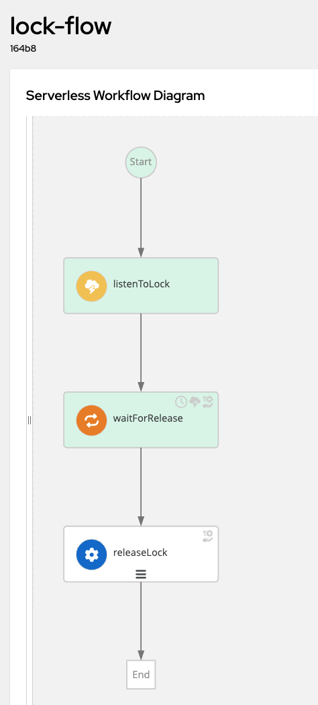
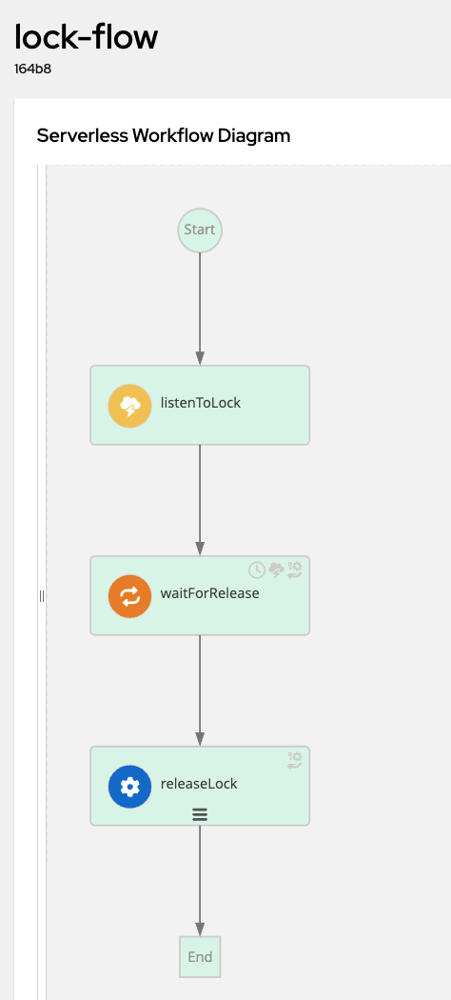

# How to Send and Receive Kafka Messages in [SonataFlow Workflows](https://sonataflow.org)

This example demonstrates how to send and receive messages from a **Kafka Broker** using the [Quarkus SmallRye Kafka Connector](https://quarkus.io/version/3.8/guides/kafka#configuring-smallrye-kafka-connector) in a **SonataFlow workflow application**.

---

## **📌 Understanding the Event Definitions**

The [workflow specification](callback-flow/src/main/resources/lock.sw.yaml) defines three key events:

```yaml
events:
  - type: lock-event
    kind: consumed
    name: lock-event
    source: local
    correlation:
      - contextAttributeName: lockid
  - type: release-event
    kind: consumed
    name: release-event
    source: local
    correlation:
      - contextAttributeName: lockid
  - type: released-event
    kind: produced
    name: released-event
    correlation:
      - contextAttributeName: lockid
```

### **🔹 Event Breakdown**
1. **`lock-event`** → Triggers the workflow execution.
2. **`release-event`** → Releases the lock, resuming the workflow.
3. **`released-event`** → Workflow emits this event upon termination.

SonataFlow only accepts messages in the [CloudEvents](https://cloudevents.io/) format. Here’s an example of a **valid CloudEvent JSON message**:

```json
{
  "specversion": "1.0",
  "id": "db16ff44-5b0b-4abc-88f3-5a71378be171",
  "source": "http://dev.local",
  "type": "lock-event",
  "datacontenttype": "application/json",
  "time": "2025-03-07T15:04:32.327635-05:00",
  "lockid": "03471a81-310a-47f5-8db3-cceebc63961a",
  "data": {
    "name": "The Kraken",
    "id": "03471a81-310a-47f5-8db3-cceebc63961a"
  }
}
```

### **🔹 Correlation in SonataFlow**
Each event definition contains `correlation.contextAttributeName`, which enables **event correlation** across workflow instances.

For example, if **10 workflows** are waiting for the `release-event`, SonataFlow will match incoming events by their `lockid` attribute to **resume only the relevant workflow instance**.

Additionally, Kafka topics are mapped to event **types**. By default, topics are named based on event types:
- `lock-event`
- `release-event`
- `released-event`

To customize the Kafka topic name, override it in **`application.properties`**:
```properties
mp.messaging.incoming.lock-event.topic=MySuperFancyTopicName
```

---

## **🛠 Running the Tests**

To better understand this example, you can run the **unit tests** located in:
- [TestWorkflowMessaging.java](callback-flow/src/test/java/org/acme/poc/sonataflow/kafka/TestWorkflowMessaging.java)

Run the tests using Maven:
```shell
cd callback-flow
mvn clean install
```

### **✅ Expected Output (Logs)**
When executed successfully, the workflow logs will show something like:

```log
INFO  [kogito-event-executor-1] Starting new process instance with signal 'lock-event'
INFO  [kogito-event-executor-1] Workflow data change
{
  "name": "The Kraken",
  "id": "3fc919e7-0ff8-45cf-b935-15d52e486b98"
}
INFO  [kogito-event-executor-1] Waiting lock release The Kraken
INFO  [kogito-event-executor-1] Lock The Kraken released
INFO  [kogito-event-executor-1] Workflow 'lock-flow' (e6054a8a-6623-4eed-a25a-583194572745) completed
```

### **🔹 Quarkus DevServices for Kafka**
Quarkus automatically starts a **lightweight Kafka broker** in test mode:

```properties
%test.quarkus.kafka.devservices.enabled=true
%test.quarkus.kafka.devservices.provider=kafka-native
%test.quarkus.kafka.devservices.topic-partitions.release-event=1
%test.quarkus.kafka.devservices.topic-partitions.lock-event=1
%test.quarkus.kafka.devservices.topic-partitions.released-event=1
```

---

## **🚀 Running the Workflow in Dev Mode**

### **1️⃣ Start a Kafka Instance**
Use **Docker** to start a Kafka broker:
```shell
docker run -d --name kafka \
  -p 9092:9092 \
  -e KAFKA_CFG_NODE_ID=0 \
  -e KAFKA_CFG_PROCESS_ROLES=controller,broker \
  -e KAFKA_CFG_CONTROLLER_QUORUM_VOTERS=0@localhost:9093 \
  -e KAFKA_CFG_LISTENERS=PLAINTEXT://0.0.0.0:9092,CONTROLLER://localhost:9093 \
  -e KAFKA_CFG_ADVERTISED_LISTENERS=PLAINTEXT://localhost:9092 \
  -e KAFKA_CFG_LISTENER_SECURITY_PROTOCOL_MAP=CONTROLLER:PLAINTEXT,PLAINTEXT:PLAINTEXT \
  -e KAFKA_CFG_CONTROLLER_LISTENER_NAMES=CONTROLLER \
  -e KAFKA_CFG_INTER_BROKER_LISTENER_NAME=PLAINTEXT \
  bitnami/kafka:latest
```

### **2️⃣ Start the Quarkus Application**
```shell
cd callback-flow
mvn clean quarkus-dev
```

### **3️⃣ Send Events to Kafka**
```shell
cat kafka-messages/lock-event.json | docker exec -i kafka kafka-console-producer.sh \
  --broker-list localhost:9092 \
  --topic lock-event
```

### **4️⃣ Verify Workflow Completion**
Refresh the **SonataFlow DevUI Console** to see the workflow state:



Send the `release-event` to resume execution:
```shell
cat kafka-messages/release-event.json | docker exec -i kafka kafka-console-producer.sh \
  --broker-list localhost:9092 \
  --topic release-event
```



### **5️⃣ Stop Kafka**
```shell
docker container stop kafka
```

---

## **🎯 Summary**
✅ **Event-driven workflows with Kafka & CloudEvents**  
✅ **Automated testing using Quarkus DevServices**  
✅ **Running Kafka locally using Docker**  
✅ **Seamless event correlation using `lockid`**

🚀 Now you're ready to **send and receive Kafka events in SonataFlow!** 🔥

